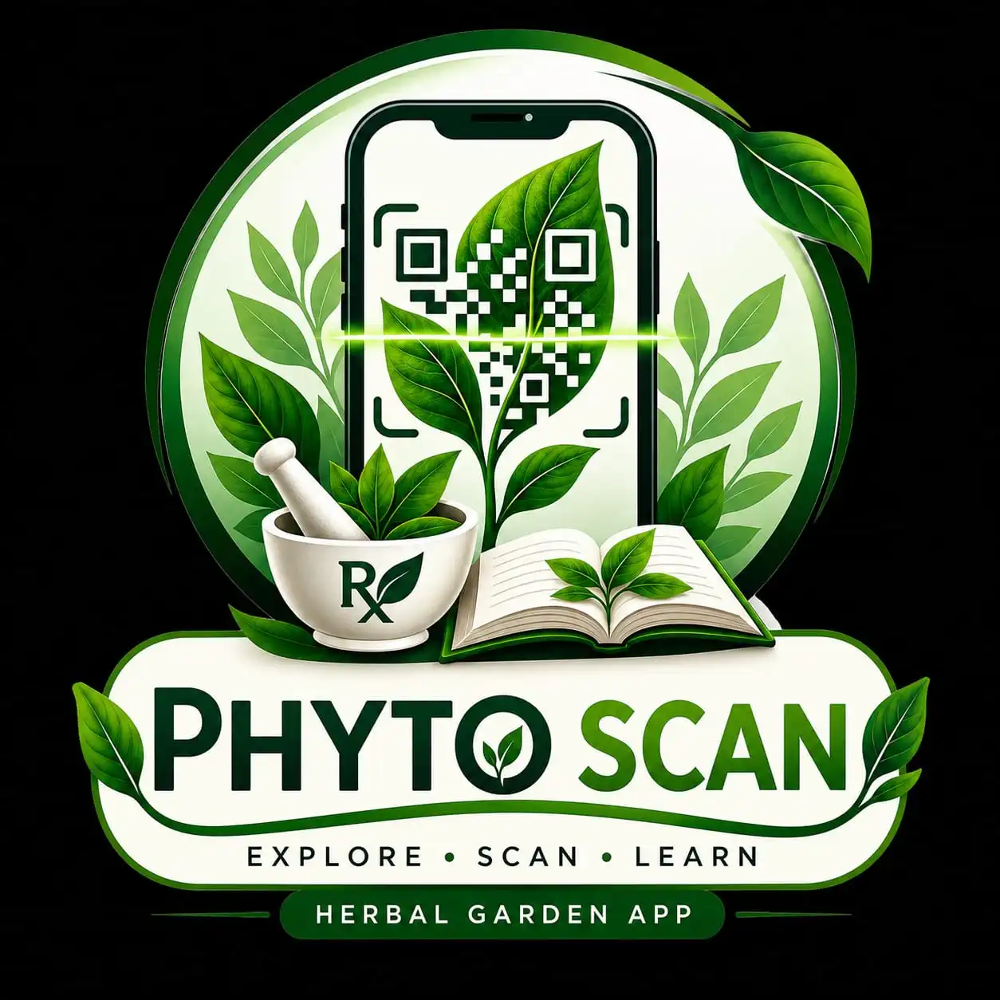

# Botany Garden — CCP

  

<h3 align="center">A digital showcase for the Botany Garden at CCP.</h3>

  Discover the plants of Chandigarh College of Pharmacy through an immersive, offline-first Android experience.

  
  
  

## About

This app was created to showcase the Botany Garden at **Chandigarh College of Pharmacy (CCP)**. It gives users an engaging way to identify plants and explore their botanical, medicinal, and cultural significance.

The experience combines a camera-based scanner with a searchable local catalog of 15 plants and their visual references.

- **Scan** plant QR codes around the garden with the device camera, with torch support.
- **Explore** the complete catalog or search by common name, botanical name, or family.
- **Learn** through botanical details, common names, habitats, medicinal uses, phytochemicals, evidence, cultivation notes, Ayurvedic properties, safety guidance, and references.
- **Browse visually** with plant galleries, spot images, maps, and full-screen image viewing.
- **Use it offline**—the catalog and image library are bundled in the app.

## Built with

- Kotlin and Jetpack Compose
- Material 3
- Android CameraX
- ZXing QR decoding
- Coil for bundled image loading
- Kotlin Serialization
- Gradle Version Catalogs

## License

No license has been added yet. Add one before distributing or accepting external contributions.
